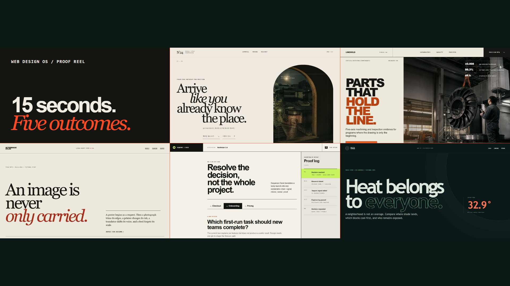
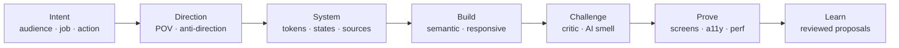
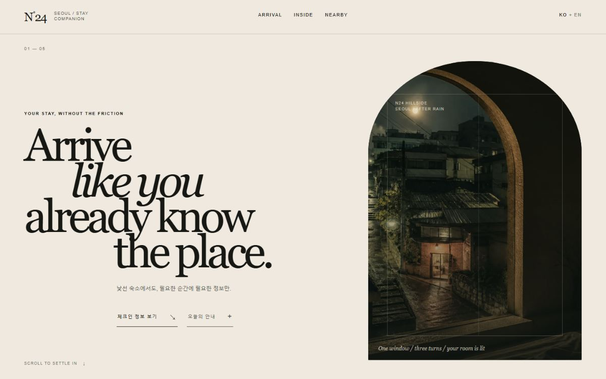
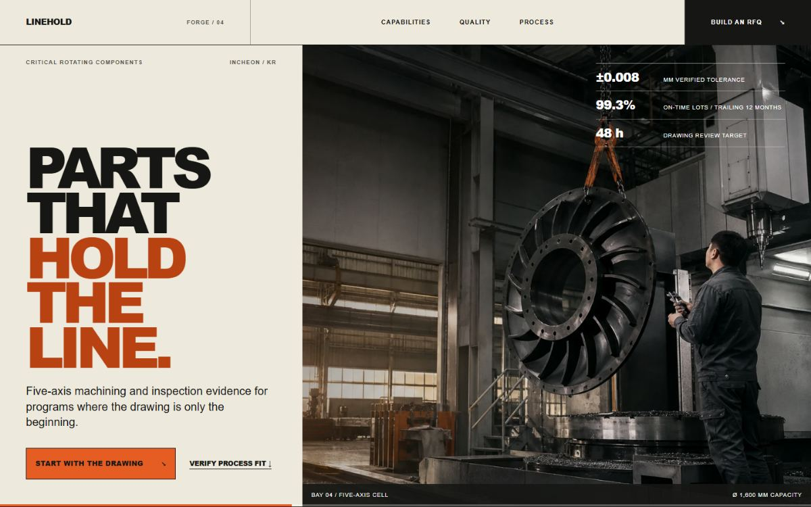
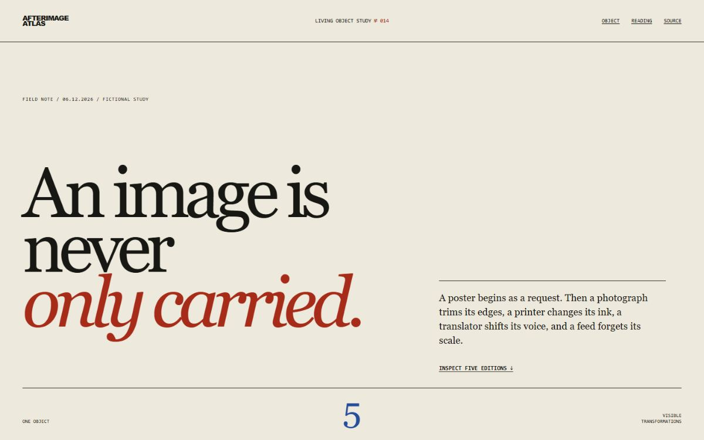
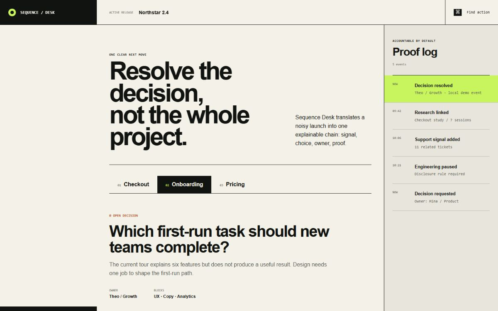
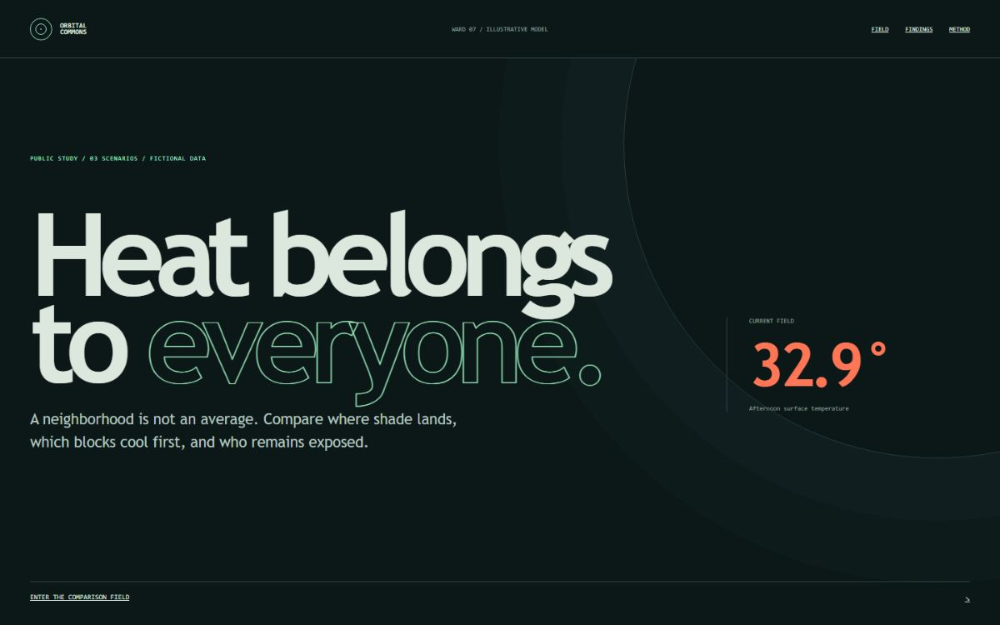

<div align="center">
  
  <h1>World-Class Web Design OS</h1>
  <p><strong>Design with a point of view. Ship with evidence.</strong></p>
  <p>An open design operating system for non-designers who can generate a front end but still struggle to judge why it feels wrong.</p>
  <p>
    <a href="docs/README.ko.md">한국어</a> ·
    <a href="https://lrinvl1203.github.io/world-class-web-design-os/">Live overview</a> ·
    <a href="#start-in-60-seconds">60-second start</a> ·
    <a href="BENCHMARK.md">Same Brief Challenge</a> ·
    <a href="CONTRIBUTING.md">Contribute</a>
  </p>
</div>

[](https://github.com/Lrinvl1203/world-class-web-design-os/stargazers)
[](https://github.com/Lrinvl1203/world-class-web-design-os/releases/latest)
[](https://github.com/Lrinvl1203/world-class-web-design-os/actions/workflows/validate.yml)
[](LICENSE)
[](.codex/skills)

<div align="center">
  <a href="https://lrinvl1203.github.io/world-class-web-design-os/assets/web-design-os-proof-15s.mp4">
    
  </a>
  <p><strong>15 seconds:</strong> one operating system, five deliberately different outputs. <a href="https://lrinvl1203.github.io/world-class-web-design-os/">Explore the live proof</a>.</p>
</div>

World-Class Web Design OS installs 17 routed specialist skills into Codex, Claude Code, Cursor, GitHub Copilot, OpenCode, or the shared `.agents/skills` convention. It guides a coding agent through discovery, art direction, components, interaction, motion, justified 3D, implementation, independent critique, accessibility, performance, and rendered visual QA.

It is not a component library or a list of style prompts. The output can look completely different from project to project because the system governs decisions and gates—not a house style.

## Start in 60 seconds

1. Install the skills:

```bash
npx --yes github:Lrinvl1203/world-class-web-design-os install --agent codex
```

Or use the [universal Agent Skills CLI](https://github.com/vercel-labs/skills) for another compatible agent:

```bash
npx --yes skills add Lrinvl1203/world-class-web-design-os -g
```

2. Start a new agent session so skill discovery refreshes.

3. Ask in one sentence:

> Use $web-design-orchestrator to redesign and implement this website for [audience], then verify it on mobile and desktop.

Broad website work routes through `web-design-orchestrator`; specialist skills load only when their job is relevant. To update an installation, append `--overwrite`. To install every declared target, use `--agent all`.

```bash
npx --yes github:Lrinvl1203/world-class-web-design-os doctor --agent codex
```

The doctor command confirms the expected 17 skills are discoverable. Both installers read this public GitHub repository directly; the universal CLI currently discovers all 17 skills without a duplicate `skills/` tree.

## What is actually in the repository

| Included | Why it matters |
|---|---|
| 1 orchestrator + 16 specialist skills | Keeps the active context focused while preserving a complete design workflow |
| 100 evidence-labeled references | Makes art-direction and technical choices searchable instead of relying on style adjectives |
| 5 runnable, contrasting website experiments | Shows that the system does not force every output into one house style |
| Playwright, axe, responsive, overflow, console, and reduced-motion gates | Turns “looks finished” into inspectable release evidence |
| Cross-agent installer and doctor | Gives Codex, Claude Code, Cursor, Copilot, OpenCode, and `.agents` users one maintained source |

## What changes in practice



- The business job and primary action are resolved before styling.
- References are decomposed into principles instead of copied wholesale.
- Three materially different art directions are considered when the direction is open.
- Motion and component sources are chosen by communication intent, not fashion.
- Mobile receives a deliberate hierarchy and composition.
- Implementation and critique are separate passes.
- Completion requires screenshots, keyboard and accessibility checks, overflow checks, and a clean console.
- Daily learning produces evidence-backed proposals; it never silently rewrites core skills.

## Proof you can open

<table>
  <tr>
    <td width="50%"><a href="https://lrinvl1203.github.io/world-class-web-design-os/experiments/nocturne-concierge/"></a></td>
    <td width="50%"><a href="https://lrinvl1203.github.io/world-class-web-design-os/experiments/linehold-forge/"></a></td>
  </tr>
  <tr>
    <td><strong>Nocturne Concierge</strong><br>Editorial hospitality · atmospheric restraint</td>
    <td><strong>Linehold Forge</strong><br>Industrial commerce · dense utility</td>
  </tr>
</table>

<table>
  <tr>
    <td width="33%"><a href="https://lrinvl1203.github.io/world-class-web-design-os/experiments/afterimage-atlas/"></a></td>
    <td width="33%"><a href="https://lrinvl1203.github.io/world-class-web-design-os/experiments/sequence-desk/"></a></td>
    <td width="33%"><a href="https://lrinvl1203.github.io/world-class-web-design-os/experiments/orbital-commons/"></a></td>
  </tr>
  <tr>
    <td><strong>Afterimage Atlas</strong><br>Editorial culture · object-led inspection</td>
    <td><strong>Sequence Desk</strong><br>Product UI · component state workflow</td>
    <td><strong>Orbital Commons</strong><br>Civic data · purposeful pseudo-3D</td>
  </tr>
</table>

| Experiment | Archetype | Internal score | Field evidence | Status |
|---|---|---:|---|---|
| [Nocturne Concierge](experiments/nocturne-concierge/) | Editorial hospitality | 92.8 | Pending | Internal target passed |
| [Linehold Forge](experiments/linehold-forge/) | Industrial commerce | 91.8 | Pending | Hold; below 92 target |
| [Afterimage Atlas](experiments/afterimage-atlas/) | Editorial culture | 92.7 | Pending | Internal target passed |
| [Sequence Desk](experiments/sequence-desk/) | Product interface | 92.8 | Pending | Internal target passed |
| [Orbital Commons](experiments/orbital-commons/) | Civic data / pseudo-3D | 94.3 | Pending | Internal target passed |

Design Quality scores are internal rubric evaluations. They are not user research, conversion data, award results, or external expert validation. See [public benchmark](docs/public-benchmark.md) for the evidence model.

## Test the claim yourself

Run [The Same Brief Challenge](BENCHMARK.md): build once with your normal agent workflow, then in a clean session with Web Design OS using the same brief, assets, model, and time budget. Publish the raw browser checks, reviewer rationale, manual corrections, and limitations. Negative and partial results are welcome.

[Submit a reproducible result](https://github.com/Lrinvl1203/world-class-web-design-os/issues/new?template=benchmark-result.yml) or [show what you built](https://github.com/Lrinvl1203/world-class-web-design-os/discussions/6).

## Public launch trail

These links prove where the project was introduced; they are not endorsements or external quality validation.

| Channel | Status | Link |
|---|---|---|
| Product Hunt | Launched Aug 11, 2026 | [Launch page](https://www.producthunt.com/products/world-class-web-design-os) |
| X | Published | [Announcement](https://x.com/lrinvl1203/status/2086859489001738289) |
| Threads | Published | [Launch post](https://www.threads.com/@lrinvl1203/post/Db3bx0OkuRD) |
| Reddit | Published | [Architecture discussion](https://www.reddit.com/r/OpenaiCodex/comments/1vkpgyr/i_turned_my_webdesign_workflow_into_17_codex/) |
| GitHub | Open for feedback | [Start-here discussion](https://github.com/Lrinvl1203/world-class-web-design-os/discussions/6) |

The machine-readable source of truth is [`config/distribution.json`](config/distribution.json); CI rejects stale or contradictory launch records.

## The 17-skill stack

The orchestrator keeps the active set small and activates specialists only when they have a job.

| Layer | Skills |
|---|---|
| Frame | `design-discovery`, `reference-forensics` |
| Direct | `art-direction`, `design-system`, `component-source-router` |
| Experience | `interaction-design`, `motion-engine`, `creative-web` |
| Build | `frontend-implementation`, `responsive-recomposition` |
| Prove | `a11y-performance`, `visual-qa`, `design-critic`, `ai-smell-detector`, `visual-polish` |
| Improve | `continuous-learning` |
| Route | `web-design-orchestrator` |

Read the [architecture](docs/architecture.md) or inspect any skill in [`.codex/skills`](.codex/skills).

## CLI

```bash
web-design-os route "editorial product site with scroll storytelling"
web-design-os search "typography motion" --limit 8
web-design-os setup .
web-design-os install --agent codex
web-design-os doctor --agent codex
web-design-os evolve --offline
web-design-os eval
```

- `route` returns at most three active specialists in addition to the orchestrator.
- `search` queries the 100-reference evidence atlas.
- `setup` creates `.web-design-os/project-context.md` without overwriting an existing brief.
- `evolve` runs the controlled learning pipeline; `--offline` uses cached and manual sources.

## Daily evolution without silent drift

The scheduled workflow collects official APIs, RSS feeds, and reviewed manual signals into a dated report. A proposal needs three independent sources and survives a 30-day cache policy before it can be considered. The automation may write evidence and proposals; it may not modify core skill instructions.

See [evolution model](evolution/README.md), [source registry](docs/source-registry.md), and [learning records](docs/learning-records.md).

Every Monday at 09:10 Asia/Seoul, `weekly-evidence-review` combines the latest repository traffic, star/fork signals, distribution state, external curation PR status, validation results, and controlled-learning output into a private 90-day artifact. It creates a review queue but never edits skills, posts, commits, opens PRs, or self-merges.

## Run locally

Requirements: Node.js 20+ and Python 3 for the full validation suite.

```bash
npm install
npm run validate
npm run eval:skills
npm run qa:install
npm run qa:launch
```

Preview the launch site:

```bash
node scripts/serve-static.mjs . 4173
```

Open `http://127.0.0.1:4173/site/`.

## Boundaries

- World-Class Web Design OS does not guarantee awards, conversion lifts, or “world-class” outcomes.
- External libraries, references, and community signals remain subject to their own licenses and terms.
- Automated checks are necessary evidence, not a replacement for representative-user research.
- High-cost 3D, WebGL, smooth scrolling, or overlapping animation libraries require an explicit communication and performance case.

Third-party names identify sources only and do not imply affiliation. Experiment imagery and claims are fictional concept material. See [notices](NOTICE.md) and the [IP/provenance audit](docs/ip-provenance.md).

## Contributing and security

Start with [CONTRIBUTING.md](CONTRIBUTING.md). Use the design-quality issue form for evidence-backed improvements. Please report security concerns through the process in [SECURITY.md](SECURITY.md), not a public issue.

If this makes your next website more deliberate, [star the repository](https://github.com/Lrinvl1203/world-class-web-design-os) so other builders can find it—and share the artifact or failure that should improve the system next.

MIT © 2026 Lrinvl1203
