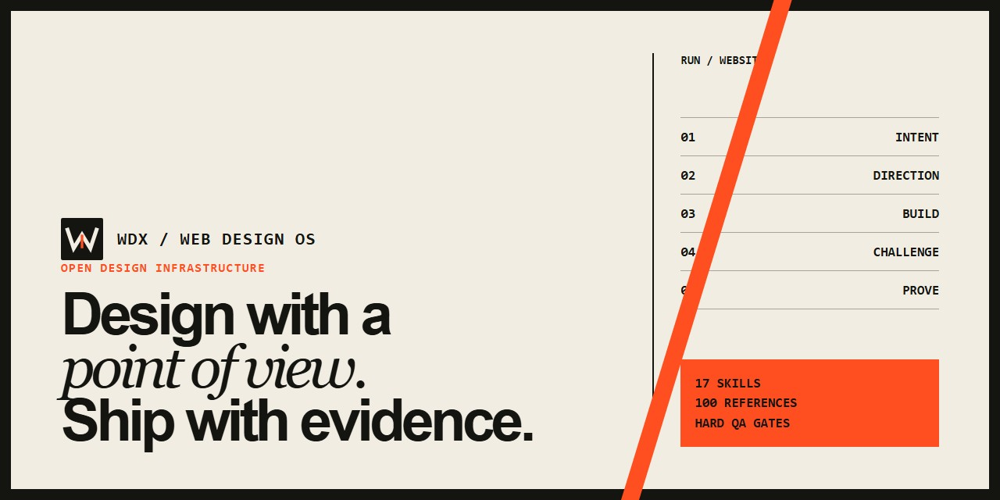
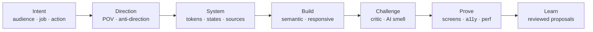

<div align="center">
  
  <h1>WDX — Web Design Operating System</h1>
  <p><strong>Design with a point of view. Ship with evidence.</strong></p>
  <p>An open operating system for distinctive, usable, accessible, and verifiable agent-made websites.</p>
  <p>
    <a href="docs/README.ko.md">한국어</a> ·
    <a href="https://lrinvl1203.github.io/world-class-web-design-os/">Live overview</a> ·
    <a href="CONTRIBUTING.md">Contribute</a>
  </p>
</div>



[](https://github.com/Lrinvl1203/world-class-web-design-os/actions/workflows/validate.yml)
[](LICENSE)
[](.codex/skills)
[](package.json)

WDX routes an AI coding agent through a complete web-design process: discovery, reference analysis, art direction, design systems, interaction and motion decisions, semantic implementation, responsive recomposition, independent critique, accessibility, performance, and rendered visual QA.

It is not a component library or a list of style prompts. The output can look completely different from project to project because the system governs decisions and gates—not a house style.

## Install in one line

```bash
npx --yes github:Lrinvl1203/world-class-web-design-os install --agent codex
```

Then ask normally:

> Design and implement a distinctive website for this product.

The repository-level rules route broad website work through `web-design-orchestrator`. To update an existing installation, append `--overwrite`. To install every declared agent target, use `--agent all`.

```bash
npx --yes github:Lrinvl1203/world-class-web-design-os doctor --agent codex
```

> The one-line GitHub install works after the repository is public. Until then, clone the repository and run `npm run wdx -- install --agent codex` locally.

## What changes in practice



- The business job and primary action are resolved before styling.
- References are decomposed into principles instead of copied wholesale.
- Three materially different art directions are considered when the direction is open.
- Motion and component sources are chosen by communication intent, not fashion.
- Mobile receives a deliberate hierarchy and composition.
- Implementation and critique are separate passes.
- Completion requires screenshots, keyboard and accessibility checks, overflow checks, and a clean console.
- Daily learning produces evidence-backed proposals; it never silently rewrites core skills.

## Proof, with labels

| Experiment | Archetype | Internal WDX | Field evidence | Status |
|---|---|---:|---|---|
| [Nocturne Concierge](experiments/nocturne-concierge/) | Editorial hospitality | 92.8 | Pending | Internal target passed |
| [VANTA Forge](experiments/vanta-forge/) | Industrial commerce | 91.8 | Pending | Hold; below 92 target |

WDX scores are internal rubric evaluations. They are not user research, conversion data, award results, or external expert validation. See [public benchmark](docs/public-benchmark.md) for the evidence model.

## The 17-skill stack

The orchestrator keeps the active set small and activates specialists only when they have a job.

| Layer | Skills |
|---|---|
| Frame | `design-discovery`, `reference-forensics` |
| Direct | `art-direction`, `design-system`, `component-source-router` |
| Experience | `interaction-design`, `motion-engine`, `creative-web` |
| Build | `frontend-implementation`, `responsive-recomposition` |
| Prove | `a11y-performance`, `visual-qa`, `design-critic`, `ai-smell-detector`, `visual-polish` |
| Improve | `continuous-learning` |
| Route | `web-design-orchestrator` |

Read the [architecture](docs/architecture.md) or inspect any skill in [`.codex/skills`](.codex/skills).

## CLI

```bash
wdx route "editorial product site with scroll storytelling"
wdx search "typography motion" --limit 8
wdx setup .
wdx install --agent codex
wdx doctor --agent codex
wdx evolve --offline
wdx eval
```

- `route` returns at most three active specialists in addition to the orchestrator.
- `search` queries the 100-reference evidence atlas.
- `setup` creates `.wdx/project-context.md` without overwriting an existing brief.
- `evolve` runs the controlled learning pipeline; `--offline` uses cached and manual sources.

## Daily evolution without silent drift

The scheduled workflow collects official APIs, RSS feeds, and reviewed manual signals into a dated report. A proposal needs three independent sources and survives a 30-day cache policy before it can be considered. The automation may write evidence and proposals; it may not modify core skill instructions.

See [evolution model](evolution/README.md), [source registry](docs/source-registry.md), and [learning records](docs/learning-records.md).

## Run locally

Requirements: Node.js 20+ and Python 3 for the full validation suite.

```bash
npm install
npm run validate
npm run eval:skills
npm run qa:install
npm run qa:launch
```

Preview the launch site:

```bash
node scripts/serve-static.mjs . 4173
```

Open `http://127.0.0.1:4173/site/`.

## Boundaries

- WDX does not guarantee awards, conversion lifts, or “world-class” outcomes.
- External libraries, references, and community signals remain subject to their own licenses and terms.
- Automated checks are necessary evidence, not a replacement for representative-user research.
- High-cost 3D, WebGL, smooth scrolling, or overlapping animation libraries require an explicit communication and performance case.

## Contributing and security

Start with [CONTRIBUTING.md](CONTRIBUTING.md). Use the design-quality issue form for evidence-backed improvements. Please report security concerns through the process in [SECURITY.md](SECURITY.md), not a public issue.

MIT © 2026 Lrinvl1203
